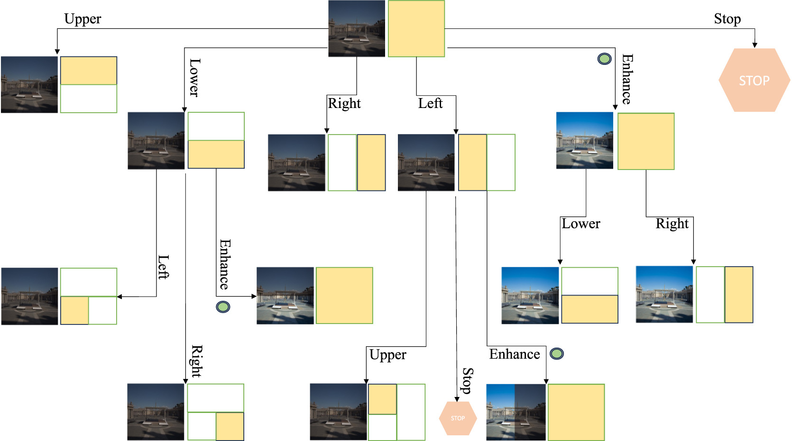
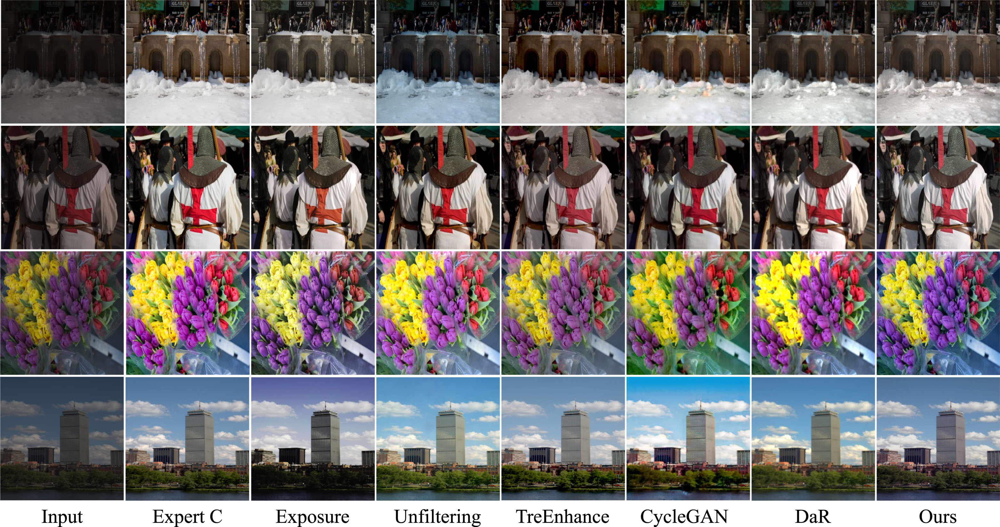

# Select & Enhance: Masked-based image enhancement through tree-search theory and deep reinforcement learning

 Official repo for the paper "Select & Enhance: Masked-based image enhancement through tree-search theory and deep reinforcement learning" published in Pattern Recognition Letters.

 [Marco Cotogni](https://scholar.google.com/citations?user=8PUz5lAAAAAJ&hl=it) and [Claudio Cusano](https://scholar.google.com/citations?hl=it&user=lhZpU_8AAAAJ&view_op=list_works&sortby=pubdate)

[](https://www.sciencedirect.com/science/article/pii/S0167865524001570)

<p align="center">

</p>

## Requirements
````
pip install -r requirements.txt
````
## Code
Code will be released soon!

<p align="center">

</p>

### Citation
If you find this code useful in your research, please consider citing:
```
@article{cotogni2024select,
  title={Select \& enhance: Masked-based image enhancement through tree-search theory and deep reinforcement learning},
  author={Cotogni, Marco and Cusano, Claudio},
  journal={Pattern Recognition Letters},
  year={2024},
  publisher={Elsevier}
}
```